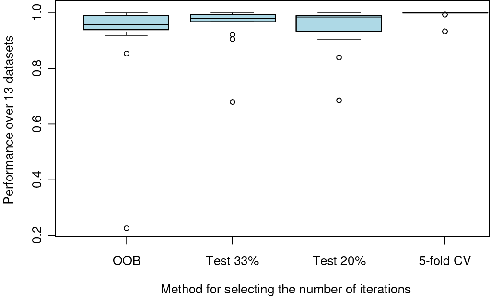

```{r, message=FALSE, echo=FALSE}
library("gbm3")
set.seed(557165559)
```

Boosting takes on various forms with different programs using different loss functions, different base models, and different optimization schemes. The gbm3 package takes the approach described in
Friedman (2001) and Friedman (2002). Some of the terminology differs, mostly due to an effort to cast boosting terms into more standard statistical terminology (e.g. deviance). In addition, the gbm3 package implements boosting for models commonly used in statistics but not commonly associated with boosting. The Cox proportional hazard model, for example, is an incredibly useful model and the boosting framework applies quite readily with only slight modification Ridgeway (1999). Also some algorithms implemented in the gbm3 package differ from the standard implementation. The AdaBoost algorithm (Freund and Schapire, 1997) has a particular loss function and a particular optimization algorithm associated with it. The gbm3 implementation of AdaBoost adopts AdaBoost's exponential loss function (its bound on misclassification rate) but uses Friedman's gradient descent algorithm rather than the original one proposed. So the main
purposes of this document is to spell out in detail what the gbm3 package implements.


**NB:** This document refers heavily to the `gbm` function.  This function is part of the original R API provided by the package; while this API is still functional, as of Version 2.1.06 the package contains an updated API which performs boosting: `gbmt`.  For more details on how to use the new API, see the "Getting started with the gbm package" vignette.

# High-level description of stochastic gradient boosting
This section provides a high-level description of stochastic gradient boosting; all of the concepts and formulas touched upon here are discussed in much greater detail further on in this document. 

Gradient boosting generates a low bias predictor by combining a lot of high bias weak learners in an additive fashion. More formally, gradient boosting approximates the function $f(\textbf{x})$, which maps covariates to the response variable *y*, as follows:
$$\hat{f}(\mathbf{x}) = \hat f_{0} + \lambda \sum_{i=1}^{T} \hat{f}_{i}(\mathbf{x}).\qquad (1)$$
The number of weak learners to fit is denoted by *T*. $\hat{f}_0$ is an initial constant. The shrinkage parameter is denoted by $\lambda$. The shrinkage parameter acts as a regularization to prevent overfitting of the model. However, while a smaller shrinkage parameter will tend to prevent overfitting it will require a larger the number of iterations *T* to achieve a desired performance.  This trade-off is discussed further in the "Getting started with gbm" vignette and in more detail later in this document.

In the `gbm3` package the weak learners are regression trees fitted to predict the residuals (or error) of the current fit from the observations' features. The process of subsampling the training set, known as bagging, and fitting the decision tree to the subsample has the effect of reducing the variance in the estimate: $\hat{f}(\mathbf{x})$. The covariate data is subsampled on a by-observation basis, that is observations are subsampled and the covariate data associated with these observations appear in the subsample. The residuals to which the trees are fitted are calculated via:
$$z_{i} = -\frac{\partial}{\partial f(\mathbf{x}_i)}\Psi(y_{i},f(\mathbf{x}_i))|_{f(\mathbf{x}_i) = \hat{f}(\mathbf{x}_i)} \qquad (2)$$
where $\Psi(y_i, f(\mathbf{x}_i))$ is the loss function (usually the negative of the log likelihood) for the model. This loss function depends on the observation's actual response $y_i$ and the mapping function's predicted response $f(\mathbf{x}_i)$ (note in (2) the function is evaluated as the model estimate at the current boosting iteration).

Now the algorithm uses the shrinkage parameter to mitigate against overfitting during boosting. However, another consideration that must be tackled is whether or not the underlying weak learners are individually overfitting to the residuals, $z_i$. If this is the case the performance of the model on new data will greatly decrease. The algorithm stops this scenario from occurring by restricting the maximum depth each decision tree can take. 

The idea behind this is that boosted trees are decomposable in terms of a "functional ANOVA decomposition". Simply put, the deeper a tree is the higher the order of the interactions between covariates the tree will model, i.e. a "stump" will only model 1st order effects and thus the model will be an additive boosted model. From this intuition, fixing the maximum depth of a tree to a sensible low order value (generally a depth of ~2-5 will suffice) reduces the complexity of fitted weak learner and reduces the possibility of overfitting.

Returning to the main algorithm, by fitting decision trees to the residuals, the boosted model's training errors are reduced as more and more weak learners are fit, while the threat of overfitting is counteracted via the bagging, shrinkage, and truncation of the individual trees. With the tree fit, the optimal terminal node predictions may be calculated via:
\label{eq:node_pred_eqn}
$$\rho_k = \arg \min_{\rho} \sum_{\mathbf{x}_i \in S_k} \Psi(y_i, \hat{f}(\mathbf{x}_i) +\rho), \qquad (3)$$

where $S_{k}$ is the set of covariate data "in" the terminal node *k* and $\rho_k$ is its optimal prediction. The optimal predictions then provide the update to the additive sum defined in (1), i.e. $\hat{f}_i(\mathbf{x}) = \sum_k \rho_{k(\mathbf{x})}$, where $k(\mathbf{x})$ indicates in which terminal node an observation with features $\mathbf{x}$ would land. If the loss associated with a node is independent of the data defining other terminal nodes in the tree, the optimal predictions can be calculated using simple line searching algorithms and sometimes can be analytically derived. These terminal node predictions determine the predictions made by an individual tree when provided with new covariate data and thus the total boosted model predictions through (1).

To conclude, it should be noted that the residuals in Equation (2) do not depend explicitly on the covariates $\mathbf{x}_i$. The residuals capture the error in the current estimate of the response variable and so the only role the covariates play, until Equation (3), is in determining the splits in the tree.  This "degree of freedom" is exploited in the implementation of the Cox proportional hazards model, see the "Guide to the Cox Proportional Hazards model" vignettes for more details.

# Gradient boosting in more detail

This section essentially presents the derivation of boosting described in Friedman (2001). The `gbm3` package also adopts the stochastic gradient boosting strategy, a small but important enhancement on the basic algorithm, described in Friedman (2002).

## Friedman's gradient boosting machine

**Friedman's Gradient Boost algorithm**

Initialize $\hat f(\mathbf{x})$ to be a constant, $\hat f_0 = \arg \min_{\rho} \sum_{i=1}^N \Psi(y_i,\rho)$. \\
  For $t$ in $1,\ldots,T$ do
  
1. Compute the negative gradient as the working response
    $$z_i = -\left.\frac{\partial}{\partial f(\mathbf{x}_i)} \Psi(y_i,f(\mathbf{x}_i)) \right|_{f(\mathbf{x}_i)=\hat f(\mathbf{x}_i)}$$
    
2. Fit a regression model, $g(\mathbf{x})$, predicting $z_i$ from the covariates $\mathbf{x}_i$.

3. Choose a gradient descent step size as
    $$\rho = \arg \min_{\rho} \sum_{i=1}^N \Psi(y_i,\hat f(\mathbf{x}_i)+\rho g(\mathbf{x}_i))$$
    
4. Update the estimate of $f(\mathbf{x})$ as
    $$\hat f(\mathbf{x}) \leftarrow \hat f(\mathbf{x}) + \rho g(\mathbf{x})$$

Friedman (2001) and the companion paper Friedman (2002) extended the work of Friedman, Hastie, and Tibshirani (2000) and laid the ground work for a new generation of boosting algorithms. Using the connection between boosting and optimization, this work proposes the Gradient Boosting Machine.

In any function estimation problem we wish to find a regression function, $\hat f(\mathbf{x})$, that minimizes the expectation of some loss function, $\Psi(y,f)$, as shown in (4).

$$
\begin{aligned}
\hspace{0.5in}
\hat f(\mathbf{x}) &= \arg \min_{f(\mathbf{x})} E_{y,\mathbf{x}} \Psi(y,f(\mathbf{x})) \qquad\qquad (4) \\ % NonparametricRegression1
&= \arg \min_{f(\mathbf{x})} E_x \left[ E_{y|\mathbf{x}} \Psi(y,f(\mathbf{x})) \Big| \mathbf{x} \right]
\end{aligned}
$$

We will focus on finding estimates of $f(\mathbf{x})$ such that
 <!-- NonparametricRegression2 -->
$$\hat f(\mathbf{x}) = \arg \min_{f(\mathbf{x})} E_{y|\mathbf{x}} \left[ \Psi(y,f(\mathbf{x}))|\mathbf{x} \right]\qquad (5)$$
Parametric regression models assume that $f(\mathbf{x})$ is a function with a finite number of parameters, $\beta$, and estimates them by selecting those values that minimize a loss function (e.g. squared error loss) over a training sample of $N$ observations on $(y,\mathbf{x})$ pairs as in (6).
<!-- {eq:Friedman1} -->
$$\hat\beta = \arg \min_{\beta} \sum_{i=1}^N \Psi(y_i,f(\mathbf{x}_i;\beta)) \qquad (6)$$
When we wish to estimate $f(\mathbf{x})$ non-parametrically the task becomes more difficult. Again we can proceed similarly to Friedman, Hastie, and Tibshirani (2000) and modify our current estimate of $f(\mathbf{x})$ by adding a new function $f(\mathbf{x})$ in a greedy fashion. Letting $f_i = f(\mathbf{x}_i)$, we see that we want to decrease the $N$ dimensional function
<!-- {EQ:Friedman2} -->
$$\begin{aligned}
J(\mathbf{f}) &= \sum_{i=1}^N \Psi(y_i,f(\mathbf{x}_i)) \nonumber \\
                          &= \sum_{i=1}^N \Psi(y_i,F_i).
\end{aligned}$$
The negative gradient of $J(\mathbf{f})$ indicates the direction of the locally greatest decrease in $J(\mathbf{f})$.  Gradient descent would then have us modify $\mathbf{f}$ as
<!-- eq:Friedman3 -->

$$\mathbf{\hat f} \leftarrow \mathbf{\hat f} - \rho \nabla J(\mathbf{f}) \qquad (7)$$


where $\rho$ is the size of the step along the direction of greatest descent. Clearly, this step alone is far from our desired goal. First, it only fits $f$ at values of $\mathbf{x}$ for which we have observations.  Second, it does not take into account that observations with similar $\mathbf{x}$ are likely to have similar values of $f(\mathbf{x})$. Both these problems would have disastrous effects on generalization error. However, Friedman suggests selecting a class of functions that use the covariate information to approximate the gradient, usually a regression tree. This line of reasoning produces his Gradient Boosting algorithm shown at the top of this section. At each iteration the algorithm determines the direction, the gradient, in which it needs to improve the fit to the data and selects a particular model from the allowable class of functions that is in most agreement with the direction. In the case of squared-error loss, $\Psi(y_i,f(\mathbf{x}_i)) = \sum_{i=1}^N (y_i-f(\mathbf{x}_i))^2$, this algorithm corresponds exactly to residual fitting.

There are various ways to extend and improve upon the basic framework suggested in the Gradient Boosting algorithm. For example, Friedman (2001) substituted several choices for $\Psi$ to develop new boosting algorithms for robust regression with least absolute deviation and Huber loss functions. Friedman (2002) showed that a simple subsampling trick can greatly improve predictive performance while simultaneously reduce computation time. This guide discusses some of these modifications next.

# Improving boosting methods using control of the learning rate, sub-sampling, and a decomposition for interpretation

This section explores the variations of the previous algorithms that have the potential to improve their predictive performance and interpretability. In particular, by controlling the optimization speed or learning rate, introducing low-variance regression methods, and applying ideas from robust regression we can produce non-parametric regression procedures with many desirable properties. As a by-product some of these modifications lead directly into implementations for learning from massive datasets. All these methods take advantage of the general form of boosting
$$\hat f(\mathbf{x}) \leftarrow \hat f(\mathbf{x}) + E(z(y,\hat f(\mathbf{x}))|\mathbf{x}) \qquad (7)$$. 

So far we have taken advantage of this form only by substituting in our favorite regression procedure for $E_w(z|\mathbf{x})$. I will discuss some modifications to estimating $E_w(z|\mathbf{x})$ that have the potential to improve our algorithm.

## Decreasing the learning rate
As several authors have phrased slightly differently, "...boosting, whatever flavor, seldom seems to overfit, no matter how many terms are included in the additive expansion". This is not true as the discussion to Friedman, Hastie, and Tibshirani (2000) points out.

In the update step of any boosting algorithm we can introduce a learning rate to dampen the proposed move.
<!-- \label{eq:shrinkage}  -->
$$\hat f(\mathbf{x}) \leftarrow \hat f(\mathbf{x}) + \lambda E(z(y,\hat f(\mathbf{x}))|\mathbf{x}) \qquad (8)$$.

By multiplying the gradient step by $\lambda$ as in (8) we have control on the rate at which the boosting algorithm descends the error surface (or ascends the likelihood surface). When $\lambda=1$ we return to performing full gradient steps. Friedman (2001) relates the learning rate to regularization through shrinkage.

The optimal number of iterations, $T$, and the learning rate, $\lambda$, depend on each other. In practice I set $\lambda$ to be as small as possible and then select $T$ by cross-validation. Performance is best when $\lambda$ is as small as possible, with decreasing marginal utility for smaller and smaller $\lambda$. Slower learning rates do not necessarily scale the number of optimal iterations. That is, when $\lambda=1.0$ and the optimal $T$ is 100 iterations, it does *not* necessarily imply that when $\lambda=0.1$ the optimal $T$ is 1000 iterations.

## Variance reduction using subsampling
Friedman (2002) proposed the stochastic gradient boosting algorithm that simply samples uniformly without replacement from the dataset before estimating the next gradient step. He found that this additional step greatly improved performance. We estimate the regression $E(z(y,\hat f(\mathbf{x}))|\mathbf{x})$ using a random subsample of the dataset.

## ANOVA decomposition
Certain function approximation methods are decomposable in terms of a "functional ANOVA decomposition". That is a function is decomposable as
<!-- \label{ANOVAdecomp}  -->
$$f(\mathbf{x}) = \sum_j f_j(x_j) + \sum_{jk} f_{jk}(x_j,x_k) + \sum_{jk\ell} f_{jk\ell}(x_j,x_k,x_\ell) + \cdots \qquad (9)$$ . 

This applies to boosted trees. Regression stumps (one split decision trees) depend on only one variable and fall into the first term of (9). Trees with two splits fall into the second term of (9) and so on. By restricting the depth of the trees produced on each boosting iteration we can control the order of approximation. Often additive components are sufficient to approximate a multivariate function well, generalized additive models, the naïve Bayes classifier, and boosted stumps for example. When the approximation is restricted to a first order we can also produce plots of $x_j$ versus $f_j(x_j)$ to demonstrate how changes in $x_j$ might affect changes in the response variable.

## Relative influence
Friedman (2001) also develops an extension of a variable's "relative influence" for boosted estimates. For tree based methods the approximate relative influence of a variable $x_j$ is
<!-- \label{RelInfluence}  -->
$$\hat J_j^2 = \hspace{-0.1in}\sum_{\mathrm{splits~on~}x_j}\hspace{-0.2in}I_t^2$$

where $I_t^2$ is the empirical improvement by splitting on $x_j$ at that point. Friedman's extension to boosted models is to average the relative influence of variable $x_j$ across all the trees generated by the boosting algorithm.

**Boosting as implemented in `gbm()`**

Select

1. a loss function (`distribution`)

2. the number of iterations, $T$ (`num_trees`)

3. the depth of each tree, $K$ (`interaction_depth`)

4. the shrinkage (or learning rate) parameter, $\lambda$ (`shrinkage`)

5. the subsampling rate, $p$ (`bag_fraction`)

Initialize $\hat f(\mathbf{x})$ to be a constant, $\hat f(\mathbf{x}) = \arg \min_{\rho} \sum_{i=1}^N \Psi(y_i,\rho)$

For $t$ in $1,\ldots,T$ do

1. Compute the negative gradient as the working response
    $$z_i = -\left.\frac{\partial}{\partial f(\mathbf{x}_i)} \Psi(y_i,f(\mathbf{x}_i)) \right|_{f(\mathbf{x}_i)=\hat f(\mathbf{x}_i)}$$
    
2. Randomly select $p\times N$ cases from the dataset

3. Fit a regression tree with $K$ terminal nodes, $g(\mathbf{x})=E(z|\mathbf{x})$. This tree is fit using only those randomly selected observations

4. Compute the optimal terminal node predictions, $\rho_1,\ldots,\rho_K$, as
$$\rho_k = \arg \min_{\rho} \sum_{\mathbf{x}_i\in S_k} \Psi(y_i,\hat f(\mathbf{x}_i)+\rho)$$
where $S_k$ is the set of $\mathbf{x}$s that define terminal node $k$. Again this step uses only the randomly selected observations.

5. Update $\hat f(\mathbf{x})$ as
    $$\hat f(\mathbf{x}) \leftarrow \hat f(\mathbf{x}) + \lambda\rho_{k(\mathbf{x})}$$
where $k(\mathbf{x})$ gives the index of the terminal node into which an observation with features $\mathbf{x}$ would fall.

# Common user options

This section discusses the options to gbm that most users will need to change or tune.

## Loss function

The first and foremost choice is `distribution`. This should be easily dictated by the application. For most classification problems either `bernoulli` or `adaboost` will be appropriate, the former being recommended. For continuous outcomes the choices are `gaussian` (for minimizing squared error), `laplace` (for minimizing absolute error), and quantile regression (for estimating percentiles of the conditional distribution of the outcome). Censored survival outcomes should require `coxph`. Count outcomes may use `poisson` although one might also consider `gaussian` or `laplace` depending on the analytical goals.

## The relationship between shrinkage and number of iterations

The issues that most new users of gbm struggle with are the choice of `num_trees` and `shrinkage`. It is important to know that smaller values of `shrinkage` (almost) always give improved predictive performance. That is, setting `shrinkage=0.001` will almost certainly result in a model with better out-of-sample predictive performance than setting `shrinkage=0.01`. However, there are computational costs, both storage and CPU time, associated with setting `shrinkage` to be low. The model with `shrinkage=0.001` will likely require ten times as many iterations as the model with `shrinkage=0.01`, increasing storage and computation time by a factor of 10. Figure 1 shows the relationship between predictive performance, the number of iterations, and the shrinkage parameter. Note that the increase in the optimal number of iterations between two choices for shrinkage is roughly equal to the ratio of the shrinkage parameters. It is generally the case that for small shrinkage parameters, 0.001 for example, there is a fairly long plateau in which predictive performance is at its best. My rule of thumb is to set `shrinkage` as small as possible while still being able to fit the model in a reasonable amount of time and storage. I usually aim for 3,000 to 10,000 iterations with shrinkage rates between 0.01 and 0.001.

```{r shrinkViters, fig.cap="**Figure 1**. Out-of-sample predictive performance by number of iterations and shrinkage. Smaller values of the shrinkage parameter offer improved predictive performance, but with decreasing marginal improvement", echo=FALSE, cache=TRUE, out.width="100%", dpi=300}
# N <- 10000
# X1 <- runif(N)
# X2 <- 2*runif(N)
# X3 <- ordered(sample(letters[1:4],N,replace=TRUE),levels=letters[4:1])
# X4 <- factor(sample(letters[1:6],N,replace=TRUE))
# X5 <- factor(sample(letters[1:3],N,replace=TRUE))
# X6 <- 3*runif(N)
# mu <- c(-1,0,1,2)[as.numeric(X3)]
# 
# SNR <- 10 # signal-to-noise ratio
# Y <- X1**1.5 + 2 * (X2**.5) + mu
# sigma <- sqrt(var(Y)/SNR)
# Y <- Y + rnorm(N,0,sigma)
# 
# ## introduce some missing values
# X1[sample(1:N,size=500)] <- NA
# X4[sample(1:N,size=300)] <- NA
# 
# data <- data.frame(Y=Y,X1=X1,X2=X2,X3=X3,X4=X4,X5=X5,X6=X6)
# 
# ## fit initial model
# shrink <- c(0.1,0.05,0.01,0.005,0.001)
# err <- vector("list",length(shrink))
# 
# for(i in 1:length(shrink))
# {
#     gbm1 <- gbm(Y~X1+X2+X3+X4+X5+X6,
#                 data=data,
#                 distribution="gaussian",
#                 n.trees=10000,
#                 shrinkage=shrink[i],
#                 interaction.depth=3,
#                 bag.fraction = 0.5,
#                 train.fraction = 0.2,
#                 n.minobsinnode = 10,
#                 keep.data=FALSE,
#                 verbose=FALSE)
#     err[[i]] <- gbm1$valid.error
# }
# 
# ylim <- range(unlist(lapply(err,range)))
# mins <- min(sapply(err,min))
# ylim <- c(0.185,0.21)
# 
# plot(0,0,ylim=ylim,xlim=c(0,10000),type="n",xlab="Iterations",ylab="Squared error")
# for(i in 1:length(shrink))
#     {
#         x <- which.min(err[[i]])
#         y <- err[[i]][x]
#         j <- round(seq(1,10000,length=500))
#         j <- sort(c(j,x))
# 
#         k <- 1:length(j)
#         lines(j[k],err[[i]][j][k],col=i)
#         rug(x, col=i)
#         text(x,y-0.0005,as.character(shrink[i]),adj=1)
#     }
# 
# abline(h=min(mins))


```

## Estimating the optimal number of iterations

gbm3 offers three methods for estimating the optimal number of iterations after the gbm model has been fit, an independent test set (`test`), out-of-bag estimation (`OOB`), and $v$-fold cross validation (`cv`). The function `gbm_perf` computes the iteration estimate.

Like Friedman's MART software, the independent test set method uses a single holdout test set to select the optimal number of iterations. If `train_fraction` is set to be less than 1, then only the *first* `train_fraction`$\times$`number of observations` will be used to fit the model. Note that if the data are sorted in a systematic way (such as cases for which *y*=1 come first), then the data should be shuffled before running gbm. Those observations not used in the model fit can be used to get an unbiased estimate of the optimal number of iterations. The downside of this method is that a considerable number of observations are used to estimate the single regularization parameter (number of iterations) leaving a reduced dataset for estimating the entire multivariate model structure. Use `gbm_perf(...,method="test")` to obtain an estimate of the optimal number of iterations using the held out test set.

If `bag_fraction` is set to be greater than 0 (0.5 is recommended), gbm computes an out-of-bag estimate of the improvement in predictive performance. It evaluates the reduction in deviance on those observations not used in selecting the next regression tree. The out-of-bag estimator underestimates the reduction in deviance. As a result, it almost always is too conservative in its selection for the optimal number of iterations. The motivation behind this method was to avoid having to set aside a large independent dataset, which reduces the information available for learning the model structure. Use `gbm_perf(...,method="OOB")` to obtain the OOB estimate.

Lastly, gbm offers $v$-fold cross validation for estimating the optimal number of iterations. If when fitting the gbm model, `cv_folds=5` then gbm will do 5-fold cross validation. gbm will fit five gbm models in order to compute the cross validation error estimate and then will fit a sixth and final gbm model with `num_trees` iterations using all of the data. The returned model object will have a component labeled `cv_error`. Note that `gbm.more` will do additional gbm iterations but will not add to the `cv_error` component. Use `gbm_perf(...,method="cv")` to obtain the cross validation estimate.

```{r oobperf2, echo = FALSE, message=FALSE, fig.align='center', fig.cap='**Figure 2**. Out-of-sample predictive performance of four methods of selecting the optimal number of iterations. The vertical axis plots performance relative the best. The boxplots indicate relative performance across thirteen real datasets from the UCI repository. See `demo(OOB-reps)`.', out.width="80%"}


```

Figure 2 compares the three methods for estimating the optimal number of iterations across 13 datasets. The boxplots show the methods performance relative to the best method on that dataset. For most datasets the method perform similarly, however, 5-fold cross validation is consistently the best of them. OOB, using a 33% test set, and using a 20% test set all have datasets for which the perform considerably worse than the best method. My recommendation is to use 5- or 10-fold cross validation if you can afford the computing time. Otherwise you may choose among the other options, knowing that OOB is conservative.

# Available distributions

This section gives some of the mathematical detail for each of the distribution options that gbm offers. The gbm engine written in C++ has access to a C++ class for each of these distributions. Each class contains methods for computing the associated deviance, initial value, the gradient, and the constants to predict in each terminal node.

In the equations shown below, for non-zero offset terms, replace $f(\mathbf{x}_i)$ with $o_i + f(\mathbf{x}_i)$.

## Gaussian

------------------------  ---------------------------------------------------------------
Deviance                  $\displaystyle \frac{1}{\sum w_i} \sum w_i(y_i-f(\mathbf{x}_i))^2$ 
Initial value             $\displaystyle \frac{\sum w_i(y_i-o_i)}{\sum w_i}$ 
Gradient                  $z_i=y_i - f(\mathbf{x}_i)$ 
Terminal node estimates   $\displaystyle \frac{\sum w_i(y_i-f(\mathbf{x}_i))}{\sum w_i}$ 
------------------------  ---------------------------------------------------------------


## AdaBoost

------------------------  ---------------------------------------------------------------
Deviance                  $\displaystyle \frac{1}{\sum w_i} \sum w_i\exp(-(2y_i-1)f(\mathbf{x}_i))$
Initial value             $\displaystyle \frac{1}{2}\log\frac{\sum y_iw_ie^{-o_i}}{\sum (1-y_i)w_ie^{o_i}}$
Gradient                  $\displaystyle z_i= -(2y_i-1)\exp(-(2y_i-1)f(\mathbf{x}_i))$
Terminal node estimates   $\displaystyle \frac{\sum (2y_i-1)w_i\exp(-(2y_i-1)f(\mathbf{x}_i))}       {\sum w_i\exp(-(2y_i-1)f(\mathbf{x}_i))}$
------------------------  ---------------------------------------------------------------

## Bernoulli

------------------------  ---------------------------------------------------------------
Deviance                  $\displaystyle -2\frac{1}{\sum w_i} \sum w_i(y_if(\mathbf{x}_i)-\log(1+\exp(f(\mathbf{x}_i))))$
Initial value             $\displaystyle \log\frac{\sum w_iy_i}{\sum w_i(1-y_i)}$
Gradient                  $\displaystyle z_i=y_i-\frac{1}{1+\exp(-f(\mathbf{x}_i))}$
Terminal node estimates   $\displaystyle \frac{\sum w_i(y_i-p_i)}{\sum w_ip_i(1-p_i)}$
                          where $\displaystyle p_i = \frac{1}{1+\exp(-f(\mathbf{x}_i))}$
------------------------  ---------------------------------------------------------------

Notes: For non-zero offset terms, the computation of the initial value requires Newton-Raphson. Initialize $f_0=0$ and iterate $\displaystyle f_0 \leftarrow f_0 + \frac{\sum w_i(y_i-p_i)}{\sum w_ip_i(1-p_i)}$ where $\displaystyle p_i = \frac{1}{1+\exp(-(o_i+f_0))}$.

## Laplace

------------------------  ---------------------------------------------------------------
Deviance                  $\frac{1}{\sum w_i} \sum w_i|y_i-f(\mathbf{x}_i)|$
Initial value             $\mathrm{median}_w(y)$
Gradient                  $z_i=\mbox{sign}(y_i-f(\mathbf{x}_i))$
Terminal node estimates   $\mathrm{median}_w(z)$
------------------------  ---------------------------------------------------------------

Notes: $\mathrm{median}_w(y)$ denotes the weighted median, defined as the solution to the equation $\sum w_iI(y_i\leq m)=\frac{1}{2}\sum w_i$

## Quantile regression

Contributed by Brian Kriegler (Kriegler, 2010).


------------------------  ---------------------------------------------------------------
Deviance                  $\frac{1}{\sum w_i} \left(\alpha\sum_{y_i>f(\mathbf{x}_i)} w_i(y_i-f(\mathbf{x}_i))\right. +$ 
                          $\left.(1-\alpha)\sum_{y_i\leq f(\mathbf{x}_i)} w_i(f(\mathbf{x}_i)-y_i)\right)$
Initial value             $\mathrm{quantile}^{(\alpha)}_w(y)$
Gradient                  $z_i=\alpha I(y_i>f(\mathbf{x}_i))-(1-\alpha)I(y_i\leq f(\mathbf{x}_i))$
Terminal node estimates   $\mathrm{quantile}^{(\alpha)}_w(z)$
------------------------  ---------------------------------------------------------------

Notes: $\mathrm{quantile}^{(\alpha)}_w(y)$ denotes the weighted quantile, defined as the solution, *q*, to the equation $\sum w_iI(y_i\leq q)=\alpha\sum w_i$


## Cox Proportional Hazard

------------------------  ---------------------------------------------------------------
Deviance                  $-2\sum w_i(\delta_i(f(\mathbf{x}_i)-\log(R_i/w_i)))$
Initial value             0
Gradient                  $\displaystyle z_i=\delta_i - \sum_j \delta_j           \frac{w_jI(t_i\geq t_j)e^{f(\mathbf{x}_i)}} {\sum_k w_kI(t_k\geq t_j)e^{f(\mathbf{x}_k)}}$
Terminal node estimates   Newton-Raphson algorithm
------------------------  ---------------------------------------------------------------

1. Initialize the terminal node predictions to 0, $\mathbf{\rho}=0$

2. Let $\displaystyle p_i^{(k)}=\frac{\sum_j I(k(j)=k)I(t_j\geq t_i)e^{f(\mathbf{x}_i)+\rho_k}}                             {\sum_j I(t_j\geq t_i)e^{f(\mathbf{x}_i)+\rho_k}}$

3. Let $g_k=\sum w_i\delta_i\left(I(k(i)=k)-p_i^{(k)}\right)$

4. Let $\mathbf{H}$ be a $k\times k$ matrix with diagonal elements

   - Set diagonal elements $H_{mm}=\sum w_i\delta_i p_i^{(m)}\left(1-p_i^{(m)}\right)$
   
   - Set off diagonal elements $H_{mn}=-\sum w_i\delta_i p_i^{(m)}p_i^{(n)}$

5. Newton-Raphson update $\mathbf{\rho} \leftarrow \mathbf{\rho} - \mathbf{H}^{-1}\mathbf{g}$

6. Return to step 2 until convergence

Notes:

- $t_i$ is the survival time and $\delta_i$ is the death indicator.

- $R_i$ denotes the hazard for the risk set, $R_i=\sum_{j=1}^N w_jI(t_j\geq t_i)e^{f(\mathbf{x}_i)}$

- $k(i)$ indexes the terminal node of observation $i$

- For speed, `gbm()` does only one step of the Newton-Raphson algorithm rather than iterating to convergence. No appreciable loss of accuracy since the next boosting iteration will simply correct for the prior iterations inadequacy.

- `gbm()` initially sorts the data by survival time. Doing this reduces the computation of the risk set from $O(n^2)$ to $O(n)$ at the cost of a single up front sort on survival time. After the
  model is fit, the data are then put back in their original order.
  

## Poisson

------------------------  ---------------------------------------------------------------
Deviance                  -2$\frac{1}{\sum w_i} \sum w_i(y_if(\mathbf{x}_i)-\exp(f(\mathbf{x}_i)))$
Initial value             $\displaystyle f(\mathbf{x})= \log\left(\frac{\sum w_iy_i}{\sum w_ie^{o_i}}\right)$
Gradient                  $z_i=y_i - \exp(f(\mathbf{x}_i))$
Terminal node estimates   $\displaystyle \log\frac{\sum w_iy_i}{\sum w_i\exp(f(\mathbf{x}_i))}$
------------------------  ---------------------------------------------------------------

The Poisson class includes special safeguards so that the most extreme predicted values are $e^{-19}$ and $e^{+19}$. This behavior is consistent with `glm()`.


## Pairwise

This distribution implements ranking measures following the *LambdaMart* algorithm Burges (2010). Instances belong to *groups*; all pairs of items with different labels, belonging to the same group, are used for training. In *Information Retrieval* applications, groups correspond to user queries, and items to (feature vectors of) documents in the associated match set to be ranked.

For consistency with typical usage, our goal is to *maximize* one of the *utility* functions listed below. Consider a group with instances $x_1, \dots, x_n$, ordered such that $f(x_1) \geq f(x_2) \geq \dots \geq f(x_n)$; i.e., the *rank* of $x_i$ is $i$, where smaller ranks are preferable. Let $P$ be the set of all ordered pairs such that $y_i > y_j$.

1. **Concordance:** Fraction of concordant (i.e, correctly ordered) pairs. For the special case of binary labels, this is equivalent to the Area under the ROC Curve.
$$\left\{ \begin{array}{l l}\frac{\|\{(i,j)\in P |
      f(x_i)>f(x_j)\}\|}{\|P\|}
    & P \neq \emptyset\\
    0 & \mbox{otherwise.}
    \end{array}\right.
$$

2. **MRR:** Mean reciprocal rank of the highest-ranked positive instance (it is assumed $y_i\in\{0,1\}$):
$$\left\{ \begin{array}{l l}\frac{1}{\min\{1 \leq i \leq n |y_i=1\}}
    & \exists i: \, 1 \leq i \leq n, y_i=1\\
    0 & \mbox{otherwise.}\end{array}\right.$$
    
3. **MAP:** Mean average precision, a generalization of MRR to multiple positive instances:
$$\left\{ \begin{array}{l l} \frac{\sum_{1\leq i\leq n | y_i=1} \|\{1\leq j\leq i
    |y_j=1\}\|\,/\,i}{\|\{1\leq i\leq n | y_i=1\}\|}  & \exists i: \,
    1 \leq i \leq n, y_i=1\\
    0 & \mbox{otherwise.}\end{array}\right.$$

4. **nDCG:** Normalized discounted cumulative gain: 
$$\frac{\sum_{1\leq i\leq n} \log_2(i+1) \, y_i}{\sum_{1\leq i\leq n}
  \log_2(i+1) \, y'_i},$$ 
where $y'_1, \dots, y'_n$ is a reordering of $y_1,\dots,y_n$ with $y'_1 \geq y'_2 \geq \dots \geq y'_n$.

The generalization to multiple (possibly weighted) groups is straightforward. Sometimes a cut-off rank $k$ is given for *MRR* and *nDCG*, in which case we replace the outer index $n$ by $\min(n,k)$.

The initial value for $f(x_i)$ is always zero. We derive the gradient of a cost function whose gradient locally approximates the gradient of the IR measure for a fixed ranking:
$$\begin{aligned}
\Phi & = \sum_{(i,j) \in P} \Phi_{ij}\\
 & = \sum_{(i,j) \in P} |\Delta Z_{ij}| \log \left( 1 + e^{-(f(x_i) -
    f(x_j))}\right),
\end{aligned}$$
where $|\Delta Z_{ij}|$ is the absolute utility difference when swapping the ranks of $i$ and $j$, while leaving all other instances the same. Define
$$\begin{aligned}
  \lambda_{ij} &= \frac{\partial\Phi_{ij}}{\partial f(x_i)}\\
  &= -|\Delta Z_{ij}| \frac{1}{1 + e^{f(x_i) - f(x_j)}}\\
&= -|\Delta Z_{ij}| \, \rho_{ij},
\end{aligned}$$
with
$$\rho_{ij} = - \frac{\lambda_{ij }}{|\Delta Z_{ij}|} = \frac{1}{1 + e^{f(x_i) - f(x_j)}}$$

 For the gradient of $\Phi$ with respect to $f(x_i)$, define
$$\begin{aligned}
\lambda_i &= \frac{\partial \Phi}{\partial f(x_i)}\\
&= \sum_{j|(i,j) \in P} \lambda_{ij} -\hspace{-0.1in}\sum_{j|(j,i) \in P} \lambda_{ji}\\
&= -\hspace{-0.1in}\sum_{j|(i,j) \in P} |\Delta Z_{ij}| \, \rho_{ij}  + \hspace{-0.1in}\sum_{j|(j,i) \in P} |\Delta Z_{ji}| \, \rho_{ji}.
\end{aligned}$$

The second derivative is
$$\begin{aligned}
   \gamma_i &\stackrel{def}{=} \frac{\partial^2\Phi}{\partial f(x_i)^2}\\
    &=  \sum_{j|(i,j) \in P} |\Delta Z_{ij}| \, \rho_{ij} \, (1-\rho_{ij})
 + \sum_{j|(j,i) \in P} |\Delta Z_{ji}| \, \rho_{ji} \, (1-\rho_{ji}).
\end{aligned}$$

Now consider again all groups with associated weights. For a given terminal node, let $i$ range over all contained instances. Then its estimate is
$$-\frac{\sum_i v_i\lambda_{i}}{\sum_i v_i \gamma_i},$$ 
where
$v_i=w(\mathbf{group}(i))/\|\{(j,k)\in\mathbf{group}(i)\}\|.$

In each iteration, instances are reranked according to the preliminary scores $f(x_i)$ to determine the $|\Delta Z_{ij}|$. Note that in order to avoid ranking bias, we break ties by adding a small amount of random noise.

# References

C. Burges (2010). "From RankNet to LambdaRank to LambdaMART: An Overview," *Microsoft Research Technical Report MSR-TR-2010-82*.

Y. Freund and R.E. Schapire (1997). "A decision-theoretic generalization of on-line learning and an application to boosting," *Journal of Computer and System Sciences* 55(1):119-139.

J.H. Friedman (2001). "Greedy Function Approximation: A Gradient Boosting Machine," *Annals of Statistics* 29(5):1189-1232.

J.H. Friedman (2002). "Stochastic Gradient Boosting," *Computational Statistics and Data Analysis* 38(4):367-378.

J.H. Friedman, T. Hastie, R. Tibshirani (2000). "Additive Logistic Regression: a Statistical View of Boosting," *Annals of Statistics* 28(2):337-374.
    
B. Kriegler and R. Berk (2010). "Small Area Estimation of the Homeless in Los Angeles, An Application of Cost-Sensitive Stochastic Gradient Boosting," *Annals of Applied Statistics* 4(3):1234-1255.

G. Ridgeway (1999). "The state of boosting," *Computing Science and Statistics* 31:172-181.